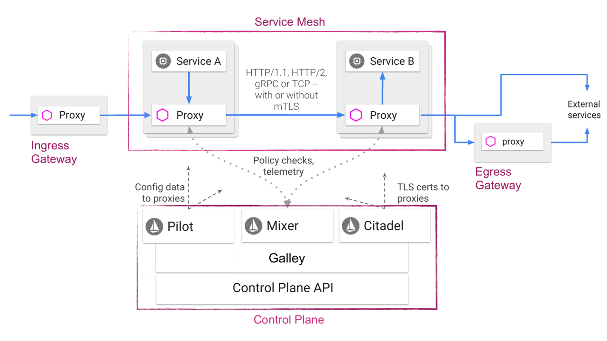

# Conceptual Istio Architecture and Components

- **Envoy**: Sidecar proxy per microservice that handles inbound/outbound traffic within each Pod. Extended version of Envoy project.
- **Gateway**: Inbound gateway / ingress. Nothing more than a managed Envoy.
- **Mixer**: Policy / precondition checks and telemetry. Highly scalable.
  - Envoy caches policy checks within the sidecar (level 1) and within envoy instances (level 2), buffers telemetry data locally and centrally, and can be run in multiple instances.
  - Mixer includes a flexible plugin model.
  - https://istio.io/blog/2017/mixer-spof-myth.html
- **Pilot**: Pilot converts high level routing rules that control traffic behavior into Envoy-specific configurations, and propagates them to the sidecars at runtime.
  - Watches services and transforms this information in a canonical platform-agnostic model (abstracting away from k8s, Nomad, Consul etc).
  - The envoy configuration is then derived from this canonical model. Exposes the Rules API to add traffic management rules.
- **Citadel**: CA for service-to-service authx and encryption.
  - Certs are delivered as a secret volume mount. Workload identity is provided in SPIFFE format.
  - https://istio.io/docs/concepts/security/mutual-tls.html
