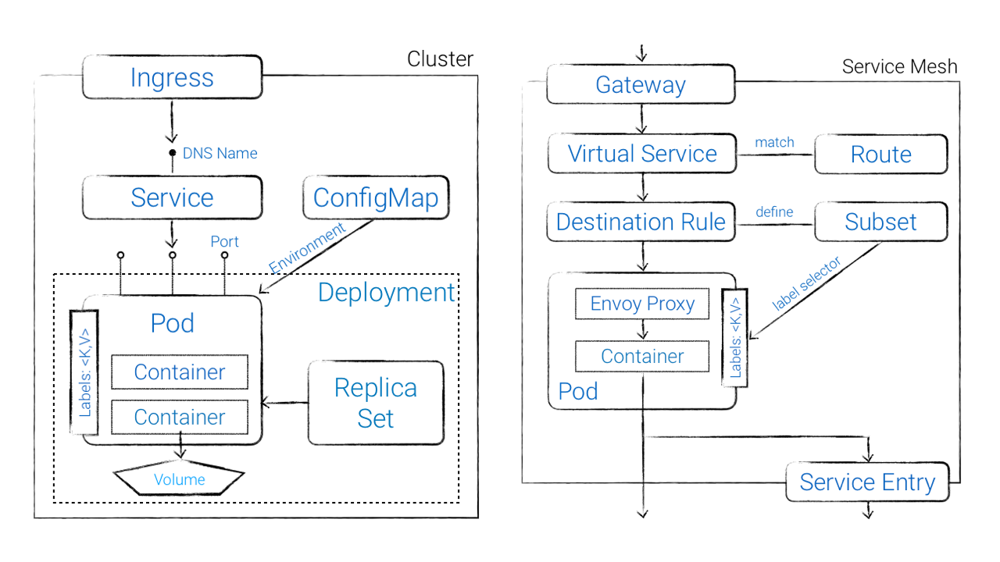

# Istio Glossary

## Kubernetes glossary

- **Pods** are the smallest unit of compute in Kubernetes
- **Labels** are key/value pairs used to identify Kubernetes resources
- **Replica Sets** ensure that the desired number of pod replicas are running
- **Deployments** are an abstraction used to declare and update pods, RCs, …
- **Services** are an abstraction for a logical collection of pods providing DNS name
- **Ingress** routes traffic from outside the cluster to services and ports based on URL patterns and host

## Istio Glossary

- **Gateway** configures a load balancer for HTTP/TCP traffic, enables ingress traffic into the service mesh
- **Virtual Service** defines the rules that control how requests for a service are routed within the service mesh
- **Destination Rule** configures the set of policies to be applied to a request after VirtualService routing has occurred
- **Service Version** aka _Subset_ allows to select a subset of pods based on labels
- **Service Entry** enables requests to services outside of the service mesh
